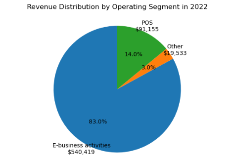
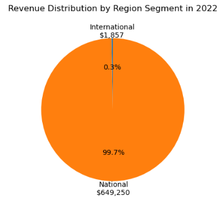
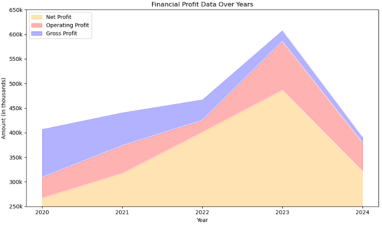
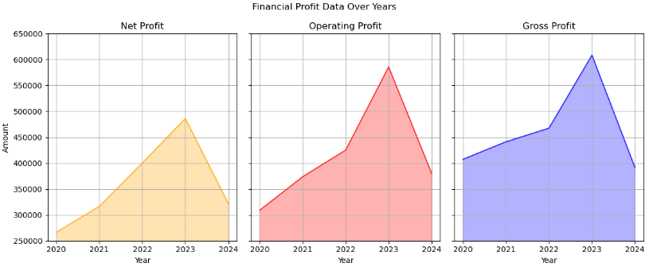
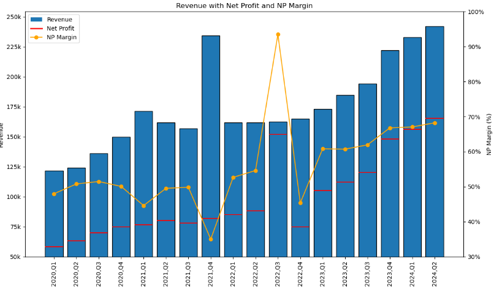
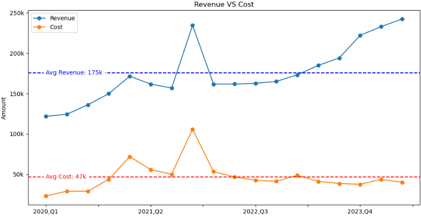
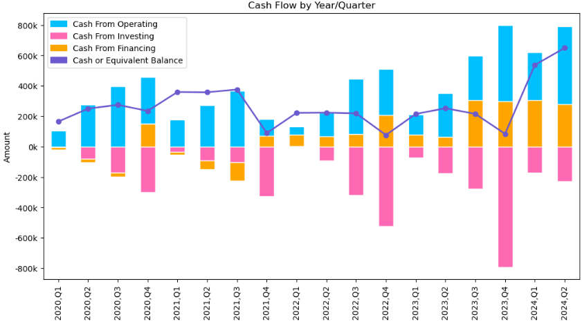
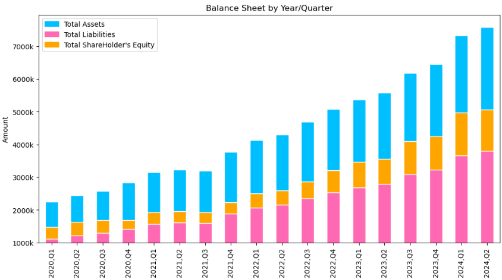
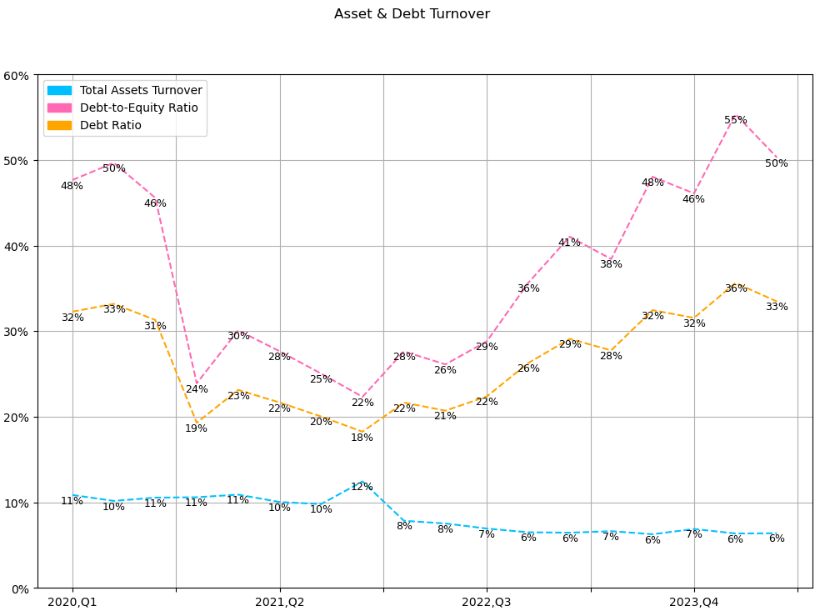
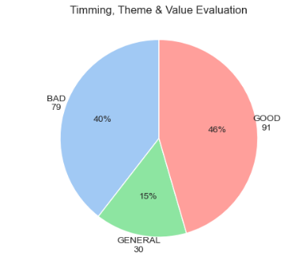

- [Overview](#overview)
- [The Questions](#the-questions)
- [Tools I Used](#tools-i-used)
- [The Analysis](#the-analysis)
  - [1. What businesses does the company operate?](#1-what-businesses-does-the-company-operate)
  - [2. Does the company's revenue come from domestic or foreign sources?](#2-does-the-companys-revenue-come-from-domestic-or-foreign-sources)
  - [3. Is the company's profit trend increasing over time?](#3-is-the-companys-profit-trend-increasing-over-time)
  - [4. Is the company's profit trend increasing over time (split version)?](#4-is-the-companys-profit-trend-increasing-over-time-split-version)
  - [5. Want more comprehensive analysis?](#5-want-more-comprehensive-analysis)
  - [6. Is there a relationship between costs and revenues?](#6-is-there-a-relationship-between-costs-and-revenues)
  - [7. How is the company's cash flow performance?](#7-how-is-the-companys-cash-flow-performance)
  - [8. How does the company's balance sheet perform?](#8-how-does-the-companys-balance-sheet-perform)
  - [9. Is the company's operational capabilities outstanding?](#9-is-the-companys-operational-capabilities-outstanding)
  - [9. Is the company's operational capabilities outstanding?](#9-is-the-companys-operational-capabilities-outstanding-1)
  - [10. Is the company's equity recommended to be held? (Informal recommendation)](#10-is-the-companys-equity-recommended-to-be-held-informal-recommendation)
- [What I Learned](#what-i-learned)
- [Challenges I Faced](#challenges-i-faced)
- [Conclusion](#conclusion)


# Overview

This project analyzes five years of financial data from a publicly listed company, focusing on income statements, balance sheets, and cash flow statements. Using Python, the data was processed to uncover key financial trends and performance indicators. The analysis primarily explores revenue growth, profit margins, and cash flow trends to provide insights into the company's financial health.

The charts and visualizations generated through Python highlight these financial trends and are supported by a dynamic Tableau dashboard, offering a more interactive view of the data. The Tableau project further enriches the analysis by providing easy-to-understand visual interpretations of complex financial metrics. You can explore the Tableau dashboard here: [Financial Statement Analysis](https://public.tableau.com/app/profile/hoo.weng.shang/viz/FinancialStatementAnalysis_17253808364160/Dashboard1).

# The Questions

Below are the questions I want to answer in my project:

1. The company's business activities
2. Evaluation of the company's financial health
3. Analysis of the company's real income trends
4. Identifying the relationship between the company's costs and revenue
5. Assessment of the company's cash flow health
6. Evaluate the company's operational capabilities
7. Applying the TTV concept to determine the holding value of the company's equity

# Tools I Used

To deep dive into the data analyst financial statement, I utilized several essential tools:

- **Python:** The core of my analysis, enabling me to derive critical insights from the data.
  - **Pandas:** A powerful library I used for data manipulation and analysis.
  - **Matplotlib:** Used to visualize the data with basic charts and graphs.
  - **Seaborn:** Helped me create more sophisticated and detailed visualizations.
- **Jupyter Notebooks:** Allowed me to seamlessly run my Python code while documenting my analysis and findings.
- **Visual Studio Code:** My preferred IDE for writing and executing Python scripts.
- **Git & GitHub:** Crucial for version control, collaboration, and tracking my code, ensuring my project stays organized and shareable.

# The Analysis

Each Jupyter notebook in this project focused on exploring particular facets of the financial statement. Below is my approach to addressing each question:

## 1. What businesses does the company operate?

To analyze a company's business, you need to understand the revenue generated by each segment, identify the primary business focus, and determine whether the company is concentrating on its core activities or becoming distracted by non-core operations. 

View my notebook with detailed steps here: [1_business_segment_operating](1_business_segment_operating.ipynb).

**<h4>Visualize Data</h4>**
```python
labels = [f"{segment}\n${revenue:,.0f}" for segment, revenue in zip(filter_df['Operating_Segment'], filter_df['Revenue'])]

plt.figure(figsize=(6,4))
plt.pie(percentage,labels=labels, autopct='%1.1f%%', startangle=90,textprops={'ha': 'center'})
plt.axis('equal')

plt.suptitle('Revenue Distribution by Operating Segment in 2022')
plt.tight_layout()
plt.show()
```

**<h4>Result</h4>**


**<h4>Insights</h4>**
- The company's primary and secondary businesses are both related to the IT field, and their proportion is relatively high.
- The "other" category accounts for only 3%, indicating that the company does not invest heavily in non-core areas for profit, which is a positive sign.
- Conversely, if the IT industry experiences significant reforms and changes, the company's revenue may be substantially impacted.

## 2. Does the company's revenue come from domestic or foreign sources?

It's important to assess whether the revenue sources are domestic or foreign. If a significant portion of the revenue comes from international markets, you should consider exchange rate fluctuations when evaluating the company.

View my notebook with detailed steps here: [2_business_segment_region](2_business_segment_region.ipynb).

**<h4>Visualize Data</h4>**
```python
labels = [f"{region}\n${revenue:,.0f}" for region, revenue in zip(filter_df['Region'], filter_df['Revenue'])]

plt.figure(figsize=(6,4))
plt.pie(percentage,labels=labels, autopct='%1.1f%%', startangle=90,textprops={'ha': 'center'})
plt.axis('equal')

plt.suptitle('Revenue Distribution by Region Segment in 2022')
plt.tight_layout()
plt.show()
```

**<h4>Result</h4>**


**<h4>Insights</h4>**
- The company's operations are primarily concentrated in domestic, with only a small portion of its business conducted abroad.
- When evaluating the company's value, you can disregard the effects of foreign exchange rate fluctuations, as they only have a minimal impact on the company's revenue.
- On the other hand, if the company's services fully meet the needs of the domestic market and there are no plans to expand internationally, it suggests that the company lacks ambition.

## 3. Is the company's profit trend increasing over time?

When analyzing financial statements, it’s important not to focus solely on the "Revenue", as it encompasses a broad range of areas and does not account for the costs associated with operating the business. To gain a clearer understanding of the company’s true profitability, the most effective approach is to observe the trends in profit increases and decreases across various aspects.

View my notebook with detailed steps here: [3_profits_versus](3_profits_versus.ipynb).

**<h4>Visualize Data</h4>**

```python
plt.figure(figsize=(10, 6))

fill_properties = [
    ('total_np', 'orange', 'Net Profit'),
    ('total_op', 'red', 'Operating Profit'),
    ('total_gp', 'blue', 'Gross Profit')
]

for i, (column, color, label) in enumerate(fill_properties):
    if i == 0:
        plt.fill_between(profit_df['year_no'], profit_df[column], color=color, label=label, alpha=0.3)
    else:
        plt.fill_between(profit_df['year_no'], profit_df[column], 
                         profit_df[fill_properties[i-1][0]], color=color, label=label, alpha=0.3)
    plt.plot(profit_df['year_no'], profit_df[column], color='white', linewidth=1)

plt.xticks(profit_df['year_no'], profit_df['year_no'])

plt.gca().yaxis.set_major_formatter(plt.FuncFormatter(lambda x, pos: f'{x/1000:.0f}k'))
plt.ylim(250000,650000)

plt.title('Financial Profit Data Over Years')
plt.xlabel('Year')
plt.ylabel('Amount (in thousands)')
plt.legend(loc='upper left')

plt.tight_layout()
plt.show()

```
**<h4>Result</h4>**


**<h4>Insights</h4>**
- The growth trends of each profit item show positive signs, indicating that the company's development is progressing steadily.
- While there was a sharp decline in profits for 2024, it's important to note that this data only reflects two quarters, whereas the figures for previous years encompass four quarters. Therefore, it would be premature to conclude that the company's overall profitability has decreased.
- The behavior of the three profit metrics is relatively consistent, allowing us to reasonably infer that the company engaging in financial misrepresentation is low.

## 4. Is the company's profit trend increasing over time (split version)?

This approach is similar to the last item, with the primary distinction being that the stacked area is divided into three separate charts. The main objective is to highlight the segmentation feature offered by the analysis tool, enhancing the comparative presentation of the data.

View my notebook with detailed steps here: [4_profits_seperate](4_profits_seperate.ipynb).

**<h4>Visualize Data</h4>**
```python
fig, ax = plt.subplots(1,3,figsize=(12,5))

fill_properties = [
    ('total_np', 'orange', 'Net Profit'),
    ('total_op', 'red', 'Operating Profit'),
    ('total_gp', 'blue', 'Gross Profit')
]

for i, (column, color, label) in enumerate(fill_properties):
    ax[i].fill_between(profit_df['year_no'],profit_df[column], color=color, alpha=0.3)
    ax[i].plot(profit_df['year_no'],profit_df[column], color=color, alpha=0.7)
    ax[i].set_title(label)
    ax[i].set_xlabel('Year')
    ax[i].set_ylabel('Amount')
    ax[i].grid(True)
    if i != 0:
        ax[i].set_yticklabels([])
        ax[i].set_ylabel('')
    ax[i].set_ylim(250000,650000)

plt.suptitle('Financial Profit Data Over Years')
plt.tight_layout()
plt.show()
```

**<h4>Result</h4>**


## 5. Want more comprehensive analysis?

Individuals have varying preferences when it comes to analyzing financial statements. This chart effectively combines two metrics with distinct calculation units into a single visualization, allowing analysts to incorporate various indicators of interest.

View my notebook with detailed steps here: [5_revenue_profit](5_revenue_profit.ipynb).

**<h4>Visualize Data</h4>**
```python
fig, ax1 = plt.subplots(figsize=(12, 7))

bars = ax1.bar(df_merged.index, df_merged['Revenue'], label='Revenue',edgecolor='black')
ax1.set_ylabel("Revenue")
ax1.yaxis.set_major_formatter(plt.FuncFormatter(lambda x, pos: f'{x/1000:.0f}k'))

for i in range(len(df_merged)):
    plt.hlines(
        y=df_merged['Net Profit'].iloc[i],  
        xmin=i - 0.4, 
        xmax=i + 0.4, 
        color='red')
    
ax2 = ax1.twinx()
line_np_margin = ax2.plot(df_merged.index, df_merged['NP Margin'], color='orange', marker='o', label='NP Margin')
ax2.set_ylabel('NP Margin (%)')

yticks = ax2.get_yticks()
ax2.set_yticks(yticks)
ax2.set_yticklabels([f'{int(tick * 100)}%' for tick in yticks])

ax1.set_xticks(df_merged.index)
ax1.set_xticklabels(df_merged.index, rotation=90, ha='center')
ax1.set_ylim(50000)

line_np = Line2D([0], [0], color='red', label='Net Profit', linestyle='-', linewidth=2)

bar_legend = Patch(label='Revenue')
fig.legend(handles=[bar_legend, line_np, line_np_margin[0]], loc="upper left", bbox_to_anchor=(0, 1), bbox_transform=ax1.transAxes)

plt.title('Revenue with Net Profit and NP Margin')

plt.tight_layout() 
plt.show()
```

**<h4>Result</h4>**


## 6. Is there a relationship between costs and revenues?

It's important to assess whether the revenue sources are domestic or foreign. If a significant portion of the revenue comes from international markets, you should consider exchange rate fluctuations when evaluating the company.

View my notebook with detailed steps here: [6_revenue_vs_cost](6_revenue_vs_cost.ipynb).

**<h4>Visualize Data</h4>**
```python
revenue_cost.plot(kind='line',figsize=(12,6),marker='o')

plt.title('Revenue VS Cost')
plt.ylabel('Amount')
plt.xlabel('')
plt.gca().yaxis.set_major_formatter(plt.FuncFormatter(lambda x, pos: f'{x/1000:.0f}k'))

avg_revenue = revenue_cost['Revenue'].mean()
avg_cost = revenue_cost['Cost'].mean()

plt.axhline(avg_revenue, color='blue', linestyle='--', linewidth=1.5, label=f'Avg Revenue: {avg_revenue/1000:.0f}k')
plt.axhline(avg_cost, color='red', linestyle='--', linewidth=1.5, label=f'Avg Cost: {avg_cost/1000:.0f}k')

plt.text(0, avg_revenue, f'Avg Revenue: {avg_revenue/1000:.0f}k', color='blue', va='center', ha='left', backgroundcolor='white')
plt.text(0, avg_cost, f'Avg Cost: {avg_cost/1000:.0f}k', color='red', va='center', ha='left', backgroundcolor='white')

plt.show()
```

**<h4>Result</h4>**


**<h4>Insights</h4>**
- In the first three years, there was a correlation between costs and revenue; however, starting around the third year, costs and revenue began to diverge.
- When considered along with Figure 1, it appears that the decline in costs is attributable to reduced demand for the "POS" business, which has subsequently led to a decrease in the consumption cost of purchasing machines.
- Moving forward, the difference between revenue and costs should not be utilized as an evaluation metric for the company, at least until the company expands into new business areas that incur additional costs.

## 7. How is the company's cash flow performance?

The primary objective of analyzing cash flow is to determine how the company's cash is being utilized, providing insights into the efficiency of its cash management.

View my notebook with detailed steps here: [7_cash_flow](7_cash_flow.ipynb).

**<h4>Visualize Data</h4>**
```python
from matplotlib.patches import Patch

custom_colors = ['hotpink', 'orange', 'deepskyblue']

ax = df_piv.iloc[:,:3].plot.bar(stacked=True,figsize=(12,6), color=custom_colors,edgecolor='white')

ax.plot(df_piv.index, df_piv['ceb'], color='slateblue', linewidth=2, marker='o', label='Cash or Equivalent Balance')

plt.title('Cash Flow by Year/Quarter')
plt.ylabel('Amount')
plt.xlabel('')

plt.gca().yaxis.set_major_formatter(plt.FuncFormatter(lambda x, pos: f'{x/1000:.0f}k'))

cfo = Patch(label='Cash From Operating',color='deepskyblue')
cfi = Patch(label='Cash From Investing',color='hotpink')
cff = Patch(label='Cash From Financing',color='orange')
ceb = Patch(label='Cash or Equivalent Balance',color='slateblue')

plt.legend(handles=[cfo, cfi,cff,ceb])

plt.show()
```

**<h4>Result</h4>**


**<h4>Insights</h4>**
- From a cash flow perspective, the company's performance is relatively average. The only notable trend is that investments at the end of each quarter tend to be higher than in other periods, possibly due to fixed maintenance costs or year-end company benefits.


## 8. How does the company's balance sheet perform?

By analyzing the company's balance sheet, we can assess the total value of its assets, liabilities, and shareholders' equity. For a stable, growing company, the balance sheet should exhibit an upward trend. However, it is equally important to ensure that the company avoids accumulating excessive debt.

View my notebook with detailed steps here: [8_balance_sheet](8_balance_sheet.ipynb).

**<h4>Visualize Data</h4>**
```python
custom_colors = ['hotpink', 'orange', 'deepskyblue']

ax = df_piv.plot.bar(stacked=True,figsize=(12,6), color=custom_colors,edgecolor='white')

plt.title('Balance Sheet by Year/Quarter')
plt.ylabel('Amount')
plt.xlabel('')

plt.gca().yaxis.set_major_formatter(plt.FuncFormatter(lambda x, pos: f'{x/1000:.0f}k'))
plt.ylim(1000000)

cfo = Patch(label='Total Assets',color='deepskyblue')
cfi = Patch(label='Total Liabilities',color='hotpink')
cff = Patch(label="Total ShareHolder's Equity",color='orange')

plt.legend(handles=[cfo, cfi,cff])
plt.show()
```

**<h4>Result</h4>**


**<h4>Insights</h4>**
- Total assets, total liabilities, and shareholders' equity have all shown consistent growth over time, suggesting that the company's operations are relatively stable.
- However, the tendency for total liabilities to exceed total assets is a concerning trend that requires careful attention.

## 9. Is the company's operational capabilities outstanding?

Examining a company's asset and liability turnover ratios provides valuable insights into its operational efficiency and overall performance.

View my notebook with detailed steps here: [9_debt_turnover](9_debt_turnover.ipynb).

**<h4>Visualize Data</h4>**
```python
df_piv = df.pivot_table(
    index='year_quater',
    values=['dr', 'der', "tat"],
    aggfunc='sum'
)

custom_colors = ['hotpink', 'orange', 'deepskyblue']

ax = df_piv.plot(kind='line',style='--',figsize=(12,8),color=custom_colors)
plt.grid(visible=True)
plt.ylim(0,60)

plt.gca().yaxis.set_major_formatter(plt.FuncFormatter(lambda x, pos: f'{x:.0f}%'))

for column in df_piv.columns:
    for x, y in enumerate(df_piv[column]):
        ax.text(x, y, f'{y:.0f}%', fontsize=9, ha='center', va='top')

tat = Patch(label='Total Assets Turnover',color='deepskyblue')
der = Patch(label='Debt-to-Equity Ratio',color='hotpink')
dr = Patch(label='Debt Ratio',color='orange')

plt.xlabel("")
plt.suptitle("Asset & Debt Turnover")

plt.legend(handles=[tat,der,dr])
plt.show()
```

**<h4>Result</h4>**


**<h4>Insights</h4>**
- The company's debt ratio has been steadily rising since 2023, aligning with the increase in total liabilities observed in Figure 8.
- The total asset turnover ratio is trending downward, suggesting that the company is gradually scaling back its inventory-based business (POS) and shifting its focus toward e-services.

## 9. Is the company's operational capabilities outstanding?

Examining a company's asset and liability turnover ratios provides valuable insights into its operational efficiency and overall performance.

View my notebook with detailed steps here: [9_debt_turnover](9_debt_turnover.ipynb).

**<h4>Visualize Data</h4>**
```python
df_piv = df.pivot_table(
    index='year_quater',
    values=['dr', 'der', "tat"],
    aggfunc='sum'
)

custom_colors = ['hotpink', 'orange', 'deepskyblue']

ax = df_piv.plot(kind='line',style='--',figsize=(12,8),color=custom_colors)
plt.grid(visible=True)
plt.ylim(0,60)

plt.gca().yaxis.set_major_formatter(plt.FuncFormatter(lambda x, pos: f'{x:.0f}%'))

for column in df_piv.columns:
    for x, y in enumerate(df_piv[column]):
        ax.text(x, y, f'{y:.0f}%', fontsize=9, ha='center', va='top')

tat = Patch(label='Total Assets Turnover',color='deepskyblue')
der = Patch(label='Debt-to-Equity Ratio',color='hotpink')
dr = Patch(label='Debt Ratio',color='orange')

plt.xlabel("")
plt.suptitle("Asset & Debt Turnover")

plt.legend(handles=[tat,der,dr])
plt.show()
```

**<h4>Result</h4>**


**<h4>Insights</h4>**
- The company's debt ratio has been steadily rising since 2023, aligning with the increase in total liabilities observed in Figure 8.
- The total asset turnover ratio is trending downward, suggesting that the company is gradually scaling back its inventory-based business (POS) and shifting its focus toward e-services.

## 10. Is the company's equity recommended to be held? (Informal recommendation)

In addition to financial data assessment, fundamental analysis also considers three key factors: timing, theme, and value, commonly known as TTV.

View my notebook with detailed steps here: [10_ttv](10_ttv.ipynb).

**<h4>Visualize Data</h4>**
```python
total_count = group_ranks['count'].sum()
group_ranks['percentage'] = (group_ranks['count'] / total_count) * 100

labels = [f"{group}\n{count:}" for group, count in zip(group_ranks['group_rank'], group_ranks['count'])]

colors = sns.color_palette("pastel6")
sns.set_style("whitegrid")

plt.figure(figsize=(6,4))
plt.pie(
group_ranks['percentage'],
labels=labels,
autopct='%1.0f%%', 
startangle=90,
colors=colors,
textprops={'ha': 'center'}
)
plt.axis('equal')

plt.suptitle('Timming, Theme & Value Evaluation')
plt.tight_layout()
plt.show()
```

**<h4>Result</h4>**


**<h4>Insights</h4>**
- Based solely on the TTV analysis, the performance is unremarkable; the evaluation of ‘GOOD’ does not hold a significant advantage over ‘BAD’ in terms of frequency. 
- Therefore, the final recommendation is `[recommend, not recommend, keep under observation]`.

# What I Learned

Through this project, I gained a deeper understanding of how to effectively analyze financial statements using Python scripts. By leveraging various libraries such as Pandas and Matplotlib, I was able to automate the generation of key financial metrics and create insightful visualizations. This allowed me to identify trends, compare performance metrics, and provide data-driven insights into the company's financial health.

In addition to improving my Python coding skills, I also enhanced my ability to interpret complex financial data, such as balance sheets, income statements, and cash flow statements. The process of transforming raw financial data into clear, actionable insights helped me grasp the importance of integrating both quantitative and qualitative analysis when evaluating a company's financial performance.

# Challenges I Faced

- **Data Complexity**: Managing large volumes of financial data required extensive cleaning and organization, necessitating the effective use of Python libraries like Pandas to ensure accuracy.

- **Visualization Issues**: Combining different financial metrics into clear, interpretable charts posed challenges, particularly with balancing multiple y-axes and ensuring clarity in visual representation.


# Conclusion

The experience not only enhanced my technical proficiency in data analysis and visualization but also deepened my understanding of financial principles. Moving forward, I am better equipped to approach complex financial data, make data-driven decisions, and apply these skills to future projects in finance and analytics.

Overall, the combination of technical skills and financial knowledge gained from this project positions me to contribute effectively to data analysis and decision-making processes in a professional setting.

